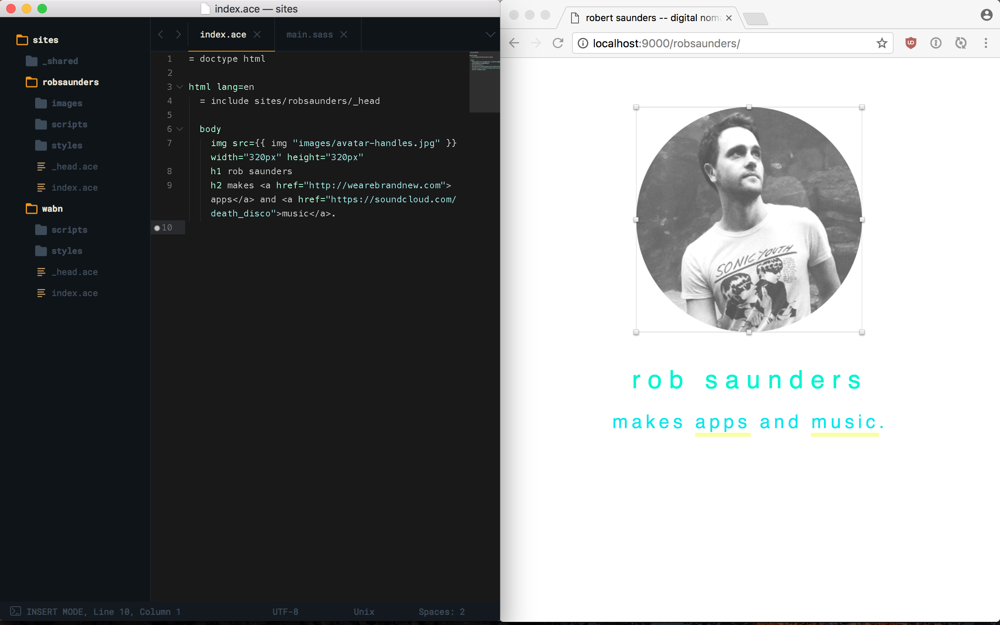

A simpler re-thinking of static site generators in golang.

- one template language [ace](https://github.com/yosssi/ace) (like haml) and one stylesheet language [gcss](https://github.com/yosssi/gcss) (like slim/sass) that are 100% golang.
- compiles to single binary with no external dependencies
- livereload with errors shown in-browser
- opinionated workflow (see folder structure)
- manage multiple static sites at once, with shared code/assets
- doesn't treat you like a wordpress template blogger
- extremely fast
- simple, easy to understand and extend code
- error messages shown in browser and stdout

If you're a developer/designer who manages a group of static sites, and you want a better workflow, this might be a good option for you, as it revolves around the idea of code/module re-use across static sites. You could build up a 'reserve' of assets such as fonts, placeholder images, regularly used styles and framework files that are always available and you can update or manage them all in one simple directory structure without crazy dependencies or messing with the black hole of stupid that is node.js.




## OMFG ANOTHER STATIC SITE GENERATOR?
Wow. Calm down. After trying many static generators I realised there's a core problem with all of them - they focus on non-technical users who want to make blogs. Nothing against this kind of user, but it's not me. I want to make actual websites that have varied structure. I don't need the program to force me into a structure I dont want to work in, which usually is:

- you are told to write markdown files as blog posts, as a first priority.
- the idea of actual design and layout is pushed into garbagey 'templates' you're supposed to download separately and muck around with.
- you don't like the way the tool works? changing it requires reading some huge documentation library and it probably doesn't support it because you aren't the target market.
- you wrestle with the primary layout file (for example, in jekyll hybrids, and find it's impossible to create your enclosing layout in haml, you have to futz around with erb and html tags - gross - I use a static generator to avoid that!).
- you put your head into your hands and quietly weep.

## How is go-staticgen different?
The code is small and simple and designed to be easy to edit. It's strongly opinionated, following a simple directory structure. You're free to enforce your own opinions as you see fit.

Just a warning though, I've only added things that golang currently supports natively. There's an example of libsass support in the project, but it is an external dependency so slows compile times and is disabled.

## Usage

```
  NAME:
    go-staticgen

  DESCRIPTION:
    An opinionated multi-site static generator written in golang.

  COMMANDS:
    new <sitename>       Creates a new site scaffolding.
    build <sitename>     Process a specific site only.
    build                Process all sites.
    serve                Serve your site locally.
```

## Folder Structure
```
public        # compiled files get generated into public
sites         # source files here
  _shared     # shared resources go here.
    images
    pages
  site1
    images
    styles
    pages
    scripts
    files
  site2
    images
    styles
    pages
```

The idea is that all your sites sit directly (no subdirs) within `/sites`, any directories starting with a `.` or `_` will be ignored. These directories are expected to have certain subdirectories (eg. `styles`, `images`, `scripts`, `fonts`, and `files`) which are processed accordingly.

## Installation (MacOS)
Grab the latest release on the (releases)[releases] page. Unzip and add to your path.

## Manually Compiling
```bash
# an example of compiling, set GOPATH however you prefer.
export GOBIN=$PWD/bin
export GOPATH=$PWD
go build -v gen
mkdir ./bin
mv ./gen ./bin/gen
# executable will be placed in bin/gen, you should copy it to /bin or within your path.
```

## Templates

### Images, fonts and files (the copy helper)
Static binary files are treated a little differently in this processor. You need to use a template helper to copy them across to your project. This is intentional, for a few reasons reasons:

#### Cleanliness
Only files you actually use are copied across to the output directory. This means if you're not using half of your images, only the used ones will be copied.

#### Error Checking
The site will throw an error if the images don't exist. You don't want to go live with a mistyped filename, or if you move a bunch of files, you don't want some other site to break assets without you knowing.

#### Cache Busting
This is a common problem with hosting static sites on CDNs. Files are output with their hash appended to the resultant filename in order to refresh caches on change.

To use these templates, use the following helper:
```haml
link href="{{ copy "styles/pure-min.css" }}" rel="stylesheet" type="text/css"
```

The files can exist in your `_shared` directory or your local directory.


### Go Templates
All templates are first run through the golang standard templating processor, so you will get all benefits and helpers provided by it. See [here](https://golang.org/pkg/text/template/) and [here](https://golang.org/pkg/html/template/).

